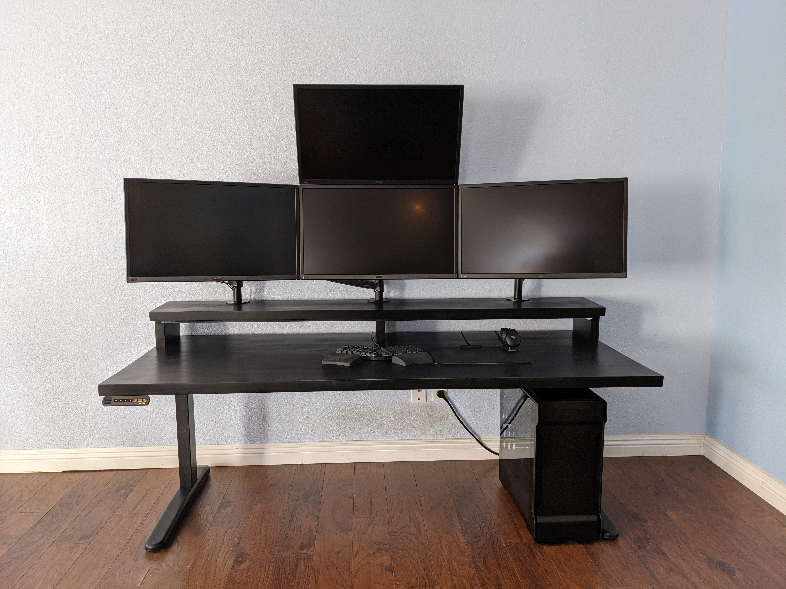

# SEL
The dream: a fun, fast, simple, consistent x-platform computing environment with fully automated deployment.

<!-- MarkdownTOC -->

- [Modules](#modules)
- [Software](#software)
- [Hardware](#hardware)

<!-- /MarkdownTOC -->

## Modules
SEL includes the following core modules. Some have grown up and moved into their own repos.

<table>
<tr>
    <th align="center">Module</th>
    <th align="center">Description</th>
</tr>
<tr>
    <td align="center">software</td>
    <td>This repo. Dotfiles and configs and such.</td>
</tr>
<tr>
    <td align="center">hardware</td>
    <td>This repo. Past/present/future hardware equipment and requirements.</td>
</tr>
<tr>
    <td align="center"><a href="https://github.com/jxcrw/idealOS">idealOS</a></td>
    <td>Conceptual design specification for how computers/devices should work.</td>
</tr>
<tr>
    <td align="center"><a href="https://github.com/jxcrw/superhi">superhi</a></td>
    <td>Human-computer interaction and automation superpowers (AutoHotkey).</td>
</tr>
<tr>
    <td align="center"><a href="https://github.com/jxcrw/aodox">aodox</a></td>
    <td>My fully custom mechanical keyboard, optimized for speed/ergonomics.</td>
</tr>
<tr>
    <td align="center"><a href="https://github.com/jxcrw/sphk">sphk</a></td>
    <td>Stenographic (chorded) input system for the 21st century and beyond.</td>
</tr>
<!-- <tr>
    <td align="center"></td>
    <td align="center"></td>
    <td align="center"></td>
    <td align="center"></td>
    <td></td>
</tr> -->
</table>

## Software
<table>
<tr>
    <th align="center">Category</th>
    <th align="center">App(s)</th>
    <th>Notes</th>
</tr>
<tr>
    <td align="center">Shell</td>
    <td align="center"></td>
    <td></td>
</tr>
<tr>
    <td align="center">Terminal</td>
    <td align="center">wt / kitty</td>
    <td>Windows Terminal best option on Windows by far. Watching Warp.</td>
</tr>
<tr>
    <td align="center">Editor/IDE</td>
    <td align="center">neovim</td>
    <td>Home at long last, after 10+ years of Sublime/IntelliJ. Watching Helix.</td>
</tr>
<tr>
    <td align="center">Browser</td>
    <td align="center">vivaldi</td>
    <td>Privacy-first + highly configurable. IDE-esque UX.</td>
</tr>
<tr>
    <td align="center">Reader</td>
    <td align="center">sioyek</td>
    <td>Highly configurable and so good it hurts.</td>
</tr>
<tr>
    <td align="center">Fileman</td>
    <td align="center"></td>
    <td></td>
</tr>
<tr>
    <td align="center">Winman</td>
    <td align="center"></td>
    <td></td>
</tr>
<tr>
    <td align="center">Email</td>
    <td align="center"></td>
    <td></td>
</tr>
</table>

_Empty means still evaluating._

## Hardware

    

